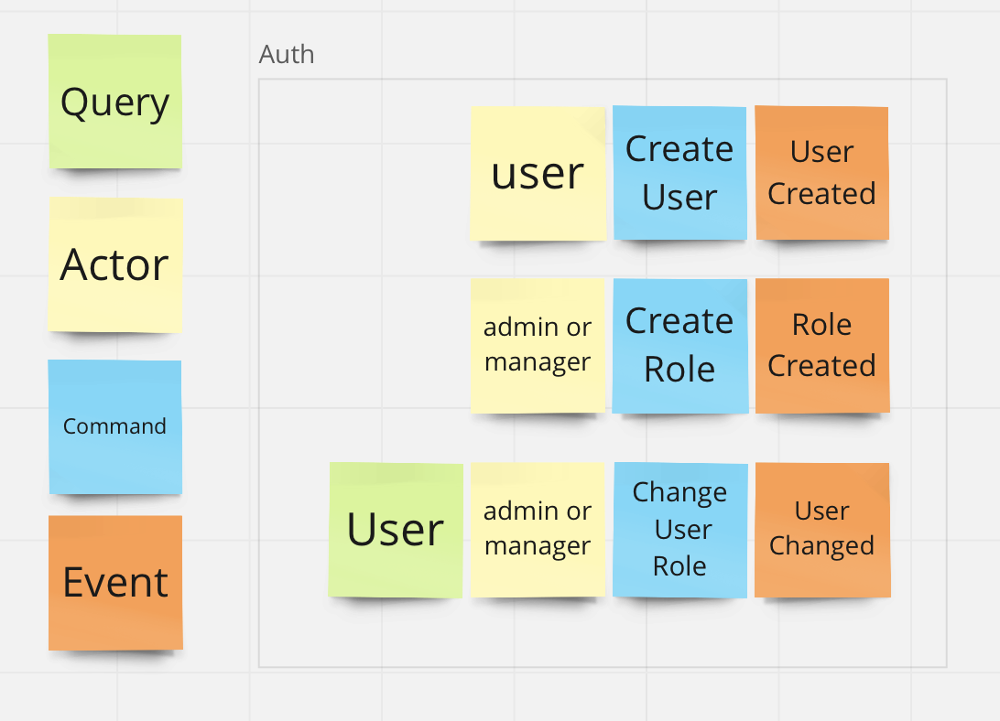
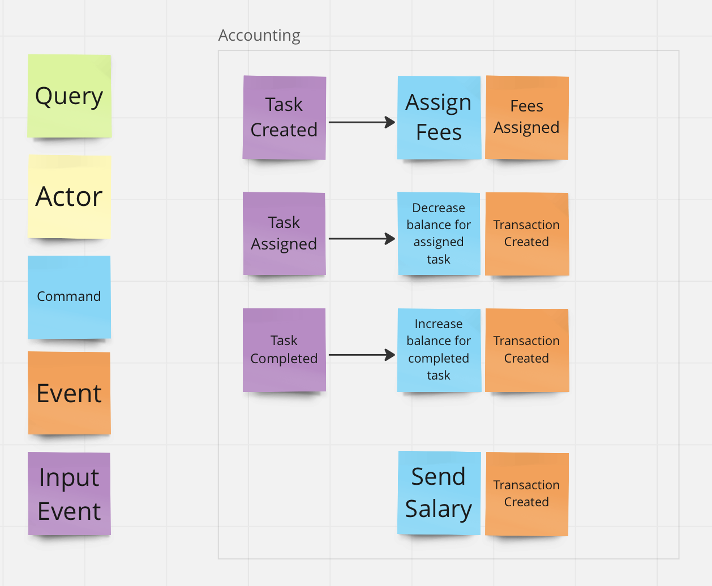
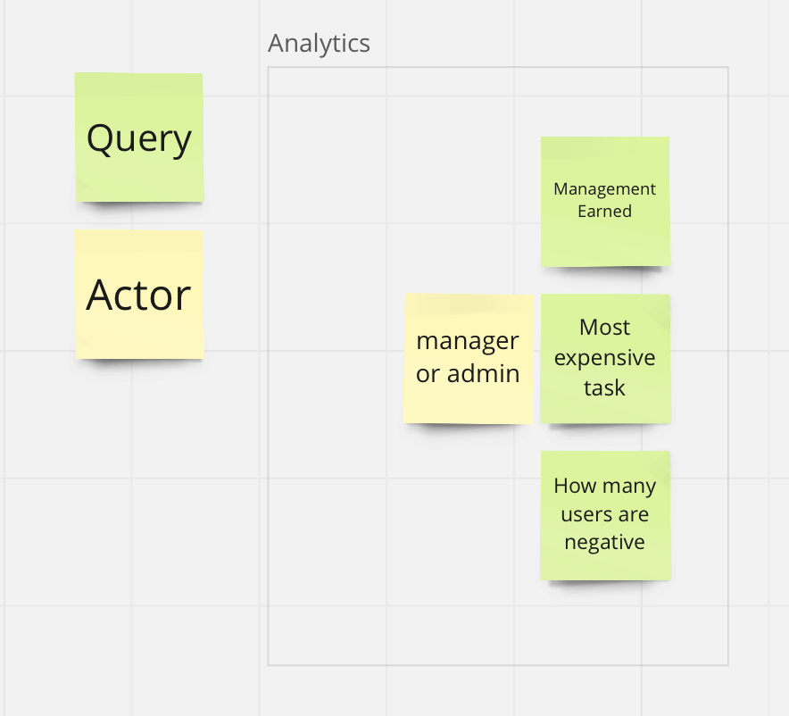

# Architecture

As the sole purpose of this project is education, the system is intentionally overengineered and heavily relies on async communications.

According to the requirements described above, I have split the solution into four domains - auth, task tracker, accounting and analytics.

<table>
    <tr>
        <td>
            <a href="auth-service-bl.png"></a>
        </td>
        <td>
            <a href="task-service-bl.png"></a>
        </td>
    </tr>
    <tr>
        <td>
            <a href="accounting-service-bl.png"></a>
        </td>
        <td>
            <a href="analytics-service-bl.png"></a>
        </td>
    </tr>
</table>

Additionally, I created web-ui (Next.js) service for UI and view-service as a backend service for web.

# Events
Events are delivered using Kafka, they use strict schemas, which are registered in the schema-registry service.

## Transactional outbox implementation
To ensure event delivery, I use [transaction outbox pattern](https://microservices.io/patterns/data/transactional-outbox.html). When a service produces an event, it writes the event data into a separate table and later this table is read by a sidecar service ```publish-service``` and events are sent out in the same order as they were written. See [publisher.service.ts](../publish-service/src/publisher/publisher.service.ts)

# Data streaming
All data objects are streamed to each service via Kafka, i.e. services do not request data from each other directly. Instead, they store streamed data in their respective databases. It reduces coupling and allows services to work independently.

